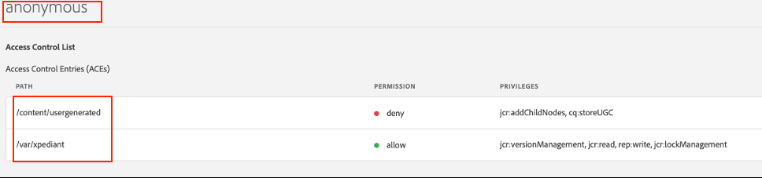

# AEM Component Catalog

## Table of Contents
1. [Code Project Structure](#1-code-project-structure)
2. [Installation Instructions](#2-installation-instructions)
3. [Configurations](#3-configurations)
4. [Permissions on author and publish](#4-permissions-on-author-and-publish)
5. [Template list overview](#5-template-list-overview)
6. [Component list overview](#6-component-list-overview)
7. [Playground Pre-content authoring overview](#7-playground-pre-content-authoring-overview)
8. [Workspaces](#8-workspaces)
9. [Features](#9-features)
10. [User Flow](#10-user-flow)
11. [Author Vs Publish experience](#11-author-vs-publish-experience)

## 1. Code Project Structure
The project follows the standard AEM maven archetype.

### Key Subprojects:
- **ui.apps** - UI AEM components
- **listaemcomponents-react** - anchor for react code
- **listaemtemplates-react** - anchor for react code
- **playground-react** - anchor for react code
- **core** - Java AEM components and Servlets
- **ui.frontend** – builds css based on boostrap
- **ui.frontend-react** – react code for playground, listaemcomponents and listaemtemplates JavaScript components.


## 2. Installation Instructions
1. Build project: `mvn clean install`

2. Install package located under "all/target" - `aem-component-catalog.all-1.0.0-SNAPSHOT.zip`

3. Create 2 pages:
   - On the first page "List AEM Components" on "Component" tab, configure it with the fields requested.

   

   - On the second page "List AEM Templates" on "Template" tab, configure it with the fields requested.

   

4. Edit the "Header" properties in order to point to the created previous pages.

   

## 3. Configurations

### 3.1 OSGi Configurations:

#### a. AEM Component Catalog Configuration Service
**`com.xpediantsolutions.ccatalog.core.services.impl.ConfigurationServiceImpl`**

**General configurations:**
- **Playground Base Path**: The temporary path where all pages and workspaces are created
- **Playground Template Path**: The template used for the playground
- **Playground Template Component Path**: The path where the playground component is inserted in the generated page
- **Template Content Path**: A fallback configuration that maps the path of the component to be examined in the generated page. This setting can also be configured in the AEM component.
- **Max Number of Workspaces**: The maximum number of workspaces that can be created
- **Workspace Cleanup Time (milliseconds)**: The lifespan of workspaces. Workspaces are automatically deleted after this time.


#### b. AEM Component Catalog Dialog Content Command
**`com.xpediantsolutions.ccatalog.core.services.impl.AEMDialogProxyCommandImpl`**

Replaces the Dialog code with custom code using a placeholder, use to apply workarounds for components JavaScript.

#### c. AEM Component Catalog Dialog Proxy
**`com.xpediantsolutions.ccatalog.core.servlets.AEMDialogProxy`**

Adds custom JavaScript for all dialogs. Dialogs are served through a proxy which allows to add custom JavaScript.

### 3.2 Component Configurations:

#### a. listaemcomponents (List AEM Components)

**Components Tab:**
- **Groups to include**: Components groups to include
- **Paths to include (Must match both groups and Paths)**: Components paths to include.


**Templates Tab:**
- **Template Title matching String**: Regular expression that filters the path of the template
- **Template Configuration Path Pattern**: Regular expression that filters the path of the template

Both values do the same thing, but is meant for the regular expression to be simpler since its split into two. Example: `/conf/xpomnichannel/settings(.)*`


**Live Usage Tab:**
- **Live Usage Query Path**: Path to limit the live usage query. If empty it uses `/content`


### 3.3 listaemtemplates (List AEM Templates):

**Templates Tab:**
- **Template Title matching String**: Regular expression that filters the path of the template
- **Template Configuration Path Pattern**: Regular expression that filters the path of the template

Both values do the same thing, but is meant for the regular expression to be simpler, since its split into two. Example: `/conf/xpomnichannel/settings(.)*`

**Live Usage Tab:**
- **Live Usage Query Path (ex /content/…)**: Path to limit the live usage query. If empty it uses `/content`

## 4. Permissions on Author and Publish

### 4.1. Author:

#### a. Author:
(author permissions)


#### b. adaptive-write system user:
- **read**:
  - `/apps`
  - `/conf`
  - `/content`
  - `/libs`
- **read, create, update, delete**:
  - `/var/xpediant`

### 4.2. Publish:

#### a. Anonymous:
- **read**:
  - `/libs/clientlibs`
  - `/libs/cq`
  - `/apps/xpomnichannel` (Need permission to the dialogs)
  - `/conf/xpomnichannel`
- **read, create, update, delete**:
  - `/var/xpediant`

#### b. adaptive-write system user:
- **read**:
  - `/apps`
  - `/conf`
  - `/content`
  - `/libs`
- **read, create, update, delete**:
  - `/var/xpediant`

## 5. Template list overview
A list of templates will be displayed. Users can search by title, and clicking on a template will show its live usage.



## 6. Component list overview
A list of components will be displayed. Users can search by title or by group, and clicking component will be redirect to the component playground page.


## 7. Playground Pre-content authoring overview

1. Click the "Enable Author View"

   

2. The page will change to author mode, author the component and then click on "SAVE DEMO CONTENT".

   

3. A new page will be added to the "import content" dropdown.
   - To delete a demo page, click on "CLEAR PAGE DEMO CONTENT", the page will be removed from the "import content" dropdown.

   

4. Click on "Enable Publish View" again, to return to the Publish View.

   

## 8. Workspaces
Each user gets their own workspace, and a cookie named: `XP_COMP_CTLG_ID` is generated to track the workspace identifier. The workspace is automatically deleted after a configurable amount of time.

Alternatively, clicking on "Clear Workspace" will delete the current user's workspace.

Users can share their workspace by appending the workspace identifier to the WS URL parameter. This parameter is displayed when clicking the 'SHARE LINK' button.


Additionally, there is a maximum number of workspaces that can be created, which is controlled by an OSGi configuration.

## 9. Features

- **Hide dialog fields**: Fields on the dialog in the playground may be hidden if they have the class (hide-in-catalog). The class is added in the dialog with granite: class attribute. The field is hidden through a custom js script in the OSGI config.

  ```xml
  <dropdown
    granite:class="cq-dialog-dropdown-showhide"
    jcr:primaryType="nt:unstructured"
    sling:resourceType="granite/ui/components/coral/foundation/form/select"
    fieldLabel="Dropdown"
    name="./dropdown">
  ```

  

- **Component Thumbnails**: The image is source from the component UI folder. The "icon.png" file will be used.

  

- **Template Thumbnails**: The image is source from the template UI folder. The "thumnail.png" file will be used.

  

## 10. User Flow

### Components
- The user navigates to the component page.

  

- The user clicks on a specific component, and the playground page for that component is displayed.

  

- The user selects a template and enables the playground options.

  

### Templates
- The user navigates to the template page.

  

- The user clicks on a specific template and the usage report is displayed.

  

## 11. Author Vs Publish experience
The Admin section is not available in the publish instance, so pre-generated content pages cannot be created there. These pages must be created and managed in the author instance.

### Author


### Publish


